## 非線形静解析手法

前述したように微小変形問題の解析においては、平衡方程式などの基礎方程式と等価な仮想仕事の原理を用いて、この式を有限要素により離散化することによって有限要素解析を行うことができる。構造物の大変形を扱う有限変形問題の解析においても基本的には仮想仕事の原理が用いられる点は同様である。しかしながら、有限変形問題においては、たとえ材料の線形性を仮定しても仮想仕事の原理式は変位に関して非線形な方程式になる。非線形式を解くためには通常、反復法による繰り返し計算が用いられる。その反復計算においては、ある小さな荷重増分に対して区分的に行なわれ、それを積み重ねて最終的な変形状態へと至る増分解析手法が用いられる。微小変形問題を仮定した場合、ひずみや応力を定義するための配置は、変形前と変形後とでとくに区別を行なっていなかった。すなわち、微小変形を仮定している場合には基礎方程式を記述する配置は変形前であっても変形後であっても問題にはならなかった。しかしながら、有限変形問題において増分解析を実施する場合、参照配置として最初の状態を参照するか、増分の開始点を参照するかの選択が可能である。前者をtotal
Lagrange法、後者をupdated
Lagrange法と呼ぶ。詳細については章末参考文献などを参照されたい。

本開発コードでは、total Lagrange法およびupdated
Lagrange法の双方を採用している。

### 幾何学的非線形解析手法

#### 仮想仕事式の増分分解

時刻ｔまでの状態が既知であり、時刻t’=t+Δｔの状態を未知とする増分解析を想定する。（図
2.2.1参照）静的境界値問題の平衡方程式、力学的境界条件、幾何学的境界条件（基本境界条件）は次の通りである。

     (2.2.1)
  ------------------------ ---------
     (2.2.2)
     (2.2.3)

ただしは、それぞれ時刻t’におけるCauchy応力（真応力）、物体力、物体表面での外向き単位法線ベクトル、既定された表面力、既定された変位である。これらの式は、時刻t’での配置に対して記述されるものである。

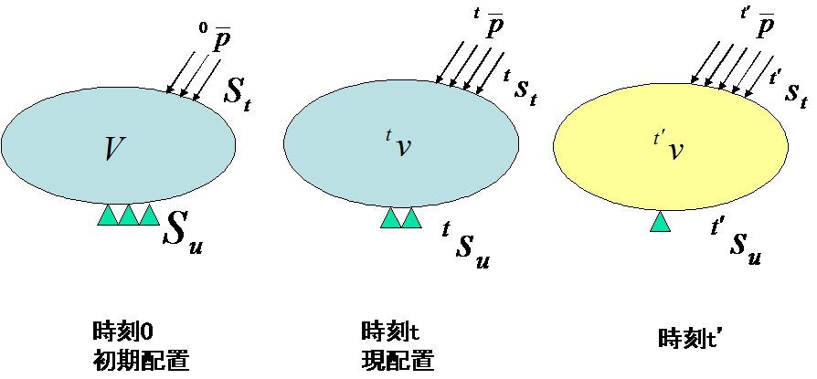{width="3.40625in" height="1.5833333333333333in"}

図 2.2.1　増分解析の概念

#### 仮想仕事の原理

式(2.2.1)の平衡方程式と式(2.2.2)の力学的境界条件と等価な仮想仕事の原理は次式で与えられる。

     (2.2.4)
  ------------------------ ---------

ここで、はAlmansiひずみテンソルの線形部分であり、具体的には次式で表される。

     (2.2.5)
  ------------------------ ---------

式(2.2.4)を幾何学的境界条件、ひずみ変位関係式、応力ひずみ関係式とともに解けばよいのであるが、式(2.2.4)は時刻t’の配置で記述されており、現段階で時刻t’の配置は未知である。そこで、時刻0の配置Ｖまたは時刻ｔでの配置を参照した定式化が行われる。

#### total Lagrange法の定式化

ここでは、開発コードで用いられるtotal Lagrange法に基づく定式化を示す。

時刻0の初期配置を基準とする時刻t’での仮想仕事の原理式は、次式で与えられる。

  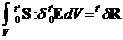   (2.2.6)
  ------------------------ ---------
     (2.2.7)

ただしは、それぞれ時刻0の初期配置を基準とする時刻t’での2nd
Piola-Kirchhoff応力テンソル、Green-Lagrangeひずみテンソルを表す。また、は、公称表面力ベクトル、初期配置の単位体積あたりに換算した物体力であり、式(2.2.1)(2.2.2)(2.2.3)と関連させて、次式で与えられる。

     (2.2.8)
  ------------------------ ---------
  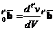   (2.2.9)

時刻tにおけるGreen-Lagrangeひずみテンソルは次式で定義される。

  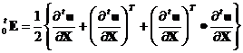   (2.2.10)
  ------------------------ ----------

ここで、時刻t’における変位、2nd
Piola-Kirchhoff応力を次式のように増分分解して表す。

     (2.2.11)
  ------------------------ ----------
     (2.2.12)

このとき、変位増分に関連して、Green-Lagrangeひずみの増分は次式で定義される。

     (2.2.13)
  ------------------------ ----------
     (2.2.14)
     (2.2.15)
  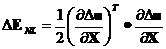   (2.2.16)

式(2.2.11)(2.2.12)(2.2.13)(2.2.14)(2.2.15)(2.2.16)を、式(2.2.6)(2.2.7)に代入して次式を得る。

     (2.2.17)
  ------------------------ ----------

ここで、は、と４階テンソルと関連づけて次式のように表されると仮定する。

     (2.2.18)
  ------------------------ ----------

式(2.2.17)に式(2.2.18)を代入し、Δuの二次以上の項を有するを省略して次式を得る。

  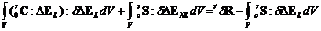   (2.2.19)
  ------------------------ ----------

式(2.2.19)を有限要素により離散化して次式を得る。

     (2.2.20)
  ------------------------ ----------

ここで、は、それぞれ、初期変位マトリクス、初期応力マトリクス、外力ベクトル、内力ベクトルである。

したがって、時刻tの状態から、時刻t’の状態を求めるための漸化式は次式で与えられる。

Step1 : 

Step2 : 

Step3 : 

#### updated Lagrange法の定式化

時刻tの現配置を基準とする時刻t’での仮想仕事の原理式は、次式で与えられる。

     (2.2.21)
  ------------------------ ----------
     (2.2.22)

ただし

     (2.2.23)
  ------------------------ ----------
  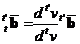   (2.2.24)

テンソルやベクトル、が時刻tの現配置を基準としているが、Green-Lagrangeひずみについては初期変位（時刻tまでの変位）を含まず

     (2.2.25)
  ------------------------ ----------

ただし

     (2.2.26)
  ------------------------ ----------
  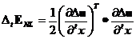   (2.2.27)

の形になる。一方

     (2.2.28)
  ------------------------ ----------

であるから、これを式(2.2.21)(2.2.22)と式(2.2.25)に代入し整理すると解くべき方程式が次のように与えられる。

  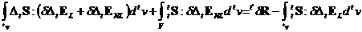   (2.2.29)
  ------------------------ ----------

ここで、は、と４階テンソルと関連づけて次式のように表されると仮定する。

     (2.2.30)
  ------------------------ ----------

これを式(2.2.29)に代入し、次式を得る。

     (2.2.31)
  ------------------------ ----------

式(2.2.31)を有限要素により離散化して次式を得る。

     (2.2.32)
  ------------------------ ----------

ここで、は、それぞれ、初期変位マトリクス、初期応力マトリクス、外力ベクトル、内力ベクトルである。

したがって、時刻tの状態から、時刻t’の状態を求めるための漸化式は次式で与えられる。

Step1 : 

Step2 : 

Step3 : 

### 材料非線形解析手法

本開発コードでは、等方性超弾性および弾塑性二種類の非線形材料を解析することができる。解析で対象とする材料は弾塑性材である場合では、updated
Lagrange法を適用し、超弾性材である場合では、total
Lagrange法を適用している。また、反復解析手法にはNewton-Raphson法を適用している。

以下にこれらの材料構成式の概要を示す。

#### 超弾性材料

等方性超弾性材料における弾性ポテンシャルエネルギーは、応力の作用していない初期状態からの等方性を持った応答から得られるものであり、右Cauchy-Green変形テンソルCの主不変量$\mathbf{\ }\left( \mathbf{\ }\mathbf{I}_{\mathbf{1}}\mathbf{,}\mathbf{I}_{\mathbf{2}}\mathbf{,}\mathbf{I}_{\mathbf{3}}\mathbf{\ } \right)\mathbf{\ }$、または体積変化を除いた変形テンソルの主不変量$\left( \mathbf{\ }{\overset{\overline{}}{\mathbf{I}}}_{\mathbf{1}}\mathbf{,\ \ }{\overset{\overline{}}{\mathbf{I}}}_{\mathbf{2}}\mathbf{,\ }{\overset{\overline{}}{\mathbf{I}}}_{\mathbf{3}}\mathbf{\ } \right)$の関数,つまり、$\mathbf{\ W = W}\left( \mathbf{\ }\mathbf{I}_{\mathbf{1}}\mathbf{,\ }\mathbf{I}_{\mathbf{2}}\mathbf{,\ }\mathbf{I}_{\mathbf{3}} \right)\mathbf{\ }$あるいは$\mathbf{W = W}\left( \mathbf{\ }{\overset{\overline{}}{\mathbf{I}}}_{\mathbf{1}}\mathbf{,\ }{\overset{\overline{}}{\mathbf{I}}}_{\mathbf{2}}\mathbf{,\ }{\overset{\overline{}}{\mathbf{I}}}_{\mathbf{3}} \right)$として表すことができる。

超弾性材の構成式は2nd
Piola-Kirchhoff応力とGreen-Lagrangeひずみの関係で定義され、その変形解析はtotal
Lagrange法を適用する。

以下では本開発コードに含まれた超弾性モデルの弾性ポテンシャルエネルギーWを列挙する。弾性ポテンシャルエネルギーWがわかれば、以下のように2nd
Piola-Kirchhoff応力および応力－ひずみ関係を計算できる

  $$S = 2\frac{\partial W}{\partial C}$$                (2.2.33)
  ----------------------------------------------------- ----------
  $$C = 4\frac{\partial^{2}W}{\partial C\partial C}$$   (2.2.34)

（１）Neo Hookean超弾性モデル

Neo-Hookean超弾性モデルは等方性を持つ線形則（Hooke則）を大変形問題へ対応できるように拡張したものである。その弾性ポテンシャルは以下のとおりである。

  $$W = C_{10}\left( {\overset{\overline{}}{I}}_{1} - 3 \right) + \frac{1}{D_{1}}\left( J - 1 \right)^{2}$$   (2.2.35)
  ----------------------------------------------------------------------------------------------------------- ----------

ここで、$\ C_{10}$と$\ D_{1}\ $は材料定数である。

（２）Mooney Rivlin超弾性モデル

  $$W = C_{10}\left( {\overset{\overline{}}{I}}_{1} - 3 \right) + C_{01}\left( {\overset{\overline{}}{I}}_{2} - 3 \right) + \frac{1}{D_{1}}\left( J - 1 \right)^{2}$$   (2.2.36)
  --------------------------------------------------------------------------------------------------------------------------------------------------------------------- ----------

ここで、$\ C_{10,}\ C_{01}$と$\ D_{1}\ $は材料定数である。

（３）Arruda Boyce超弾性モデル

  $$W = \mu\ \left\lbrack \ \frac{1}{2}\left( \ {\overset{\overline{}}{I}}_{1} - 3 \right) + \frac{1}{20\lambda_{m}^{2}}\ \left( \ {\overset{\overline{}}{I}}_{1}^{2} - 9 \right) + \frac{11}{1050\lambda_{m}^{2}}\left( \ {\overset{\overline{}}{I}}_{1}^{3} - 27 \right) + \frac{19}{7000\lambda_{m}^{2}}\left( \ {\overset{\overline{}}{I}}_{1}^{4} - 81 \right) + \frac{519}{673750\lambda_{m}^{2}}\left( \ {\overset{\overline{}}{I}}_{1}^{5} - 243 \right)\  \right\rbrack + \frac{1}{D}\left( \ \frac{J^{2} - 1}{2} - \ln J\  \right)$$   (2.2.37)
  ---------------------------------------------------------------------------------------------------------------------------------------------------------------------------------------------------------------------------------------------------------------------------------------------------------------------------------------------------------------------------------------------------------------------------------------------------------------------------------------------------------------------------------------------- ----------
  $$\mu = \frac{\mu_{0}}{1 + \frac{3}{5{\lambda_{m}}^{2}} + \frac{99}{175{\lambda_{m}}^{4}} + \frac{513}{875{\lambda_{m}}^{6}} + \frac{42039}{67375{\lambda_{m}}^{8}}}$$                                                                                                                                                                                                                                                                                                                                                                         (2.2.38)

ここで、$\text{\ μ}$, $\lambda_{m}$と$\text{\ D\ }$は材料定数である。

#### 弾塑性材料

本開発コードでは、関連流れ則に準じる弾塑性構成式を適用している。また、その構成式はKirchhoff応力のJaumman速度と変形速度テンソルの関係を表し、その変形解析はupdated
Lagrange法を適用する。

（１）弾塑性構成式

弾塑性体の降伏条件が次のように与えられるものとする。

初期の降伏条件

     (2.2.39)
  ------------------------ ----------

後続の降伏条件

     (2.2.40)
  ------------------------ ----------

ここで、

*F*:　降伏関数

σ~y0~:初期降伏応力、　　　　σ~y~:後続の降伏応力

**σ**: 応力テンソル、　　　**e**: 微小ひずみテンソル

$\text{\ \ \ \ \ \ \ \ \ }\mathbf{e}^{p}$:塑性ひずみテンソル
${\overset{\overline{}}{e}}^{p}:$ 相当塑性ひずみ

降伏応力-相当塑性ひずみ関係が、単軸状態での応力-塑性ひずみ関係に一致するものとする。

単軸状態での応力-塑性ひずみ関係：

     (2.2.41)
  ------------------------ ----------
     (2.2.42)

相当応力-相当塑性ひずみ関係：

     (2.2.43)
  ------------------------ ----------
     (2.2.44)

後続の降伏関数は一般には温度、塑性ひずみ仕事の関数であるが、ここでは簡単のため相当塑性ひずみのみの関数であるものとする。塑性変形の進行中はF=0が満たされ続ける為、次式が成立しなければならない。

     (2.2.44)
  ------------------------- ----------

式(2.2.44)中のはFの時間導関数を表しており、以後、ある量Aの時間導関数をで表す。

ここで、塑性ポテンシャルΘの存在を仮定し、塑性ひずみ速度を次式で表すものとする。

  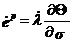   (2.2.45)
  ------------------------- ----------

ここで$\dot{\lambda}$は係数である。

さらに、塑性ポテンシャルΘが降伏関数Fに等しいものとして、次式の関連流れ則を仮定する。

     (2.2.46)
  ------------------------- ----------

この式を式(2.4.44)に代入し、下式が得られる。

     (2.2.47)
  ------------------------- ----------

ここで、**D**は弾性マトリクスであり、

       (2.2.48)
  ------------------------------------------------------------------------- ----------

弾塑性の応力―ひずみ関係式は以下のように書ける。

  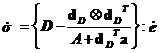   (2.2.49)
  ------------------------- ----------

弾塑性材の降伏関数(2.2.49)がわかれば、この式からその構成式が得られる。

（１）降伏関数

以下では本開発コードに含まれた弾塑性降伏関数を列挙する

・Von Mises降伏関数

  $$F = \ \sqrt{3\mathbf{J}_{2}} - \sigma_{y} = 0$$   (2.2.50)
  --------------------------------------------------- ----------

・Mohr-Coulomb降伏関数

  $$F = \ \sigma_{1} - \sigma_{3} + \ \left( \ \sigma_{1} + \sigma_{3}\  \right)\sin\phi - 2\ c\cos\phi = 0$$   (2.2.51)
  ------------------------------------------------------------------------------------------------------------- ----------

・Drucker-Prager降伏関数

  $$F = \ \sqrt{\mathbf{J}_{2}} - \ \alpha\ \mathbf{\sigma}\ :\mathbf{I} - \sigma_{y} = 0$$   (2.2.52)
  ------------------------------------------------------------------------------------------- ----------

ここでは、材料定数αとσ~y~は材料の粘着力と摩擦角から以下のように計算する

  $$\alpha = \frac{2\sin\phi}{3 + \sin\phi}\ \ ,\ \ \ \ \ \ \ \ \sigma_{y} = \frac{6\ c\cos\phi}{3 + \sin\phi}$$   (2.2.53)
  ---------------------------------------------------------------------------------------------------------------- ----------

#### 粘弾性材料

本開発コードでは、一般化されたMaxwellモデルを適用している。その構成式は以下のように偏差ひずみ**e**と偏差粘性ひずみ**q**の関数になる。

  $$\mathbf{\sigma}\ \left( \text{\ t\ } \right) = \ Ktr\mathbf{\varepsilon I +}2G\left( \mu_{0}\mathbf{e} + \mu\mathbf{q} \right)$$   (2.2.54)
  ------------------------------------------------------------------------------------------------------------------------------------ ----------

ここでは

  $$\mu\mathbf{q =}\sum_{\mathbf{m = 1}}^{\mathbf{M}}\mu_{\mathbf{m}}\mathbf{q}^{\mathbf{(m)}}\mathbf{;\ \ \ \ \ \ \ \ }\sum_{\mathbf{m = 0}}^{\mathbf{M}}\mu_{\mathbf{m}}\mathbf{=}1$$   (2.2.55)
  --------------------------------------------------------------------------------------------------------------------------------------------------------------------------------------- ----------

である。また、qは

  $${\dot{\mathbf{q}}}^{(m)} + \frac{1}{\lambda_{m}}\mathbf{q}^{\left( m \right)} = \dot{\mathbf{e}}$$   (2.2.56)
  ------------------------------------------------------------------------------------------------------ ----------

から求められる。ここでは$\lambda_{m}$はリラクゼーションである。また、リラクゼーション係数Gは、以下のProny級数で表す。

  $$\text{\ \ \ \ \ \ \ G\ }\left( \text{\ t\ } \right) = \ G\left\lbrack \mu_{0} + \sum_{i = 1}^{M}{\mu_{m}\exp\left( \frac{- t}{\lambda_{m}\ } \right)} \right\rbrack$$   (2.2.57)
  ------------------------------------------------------------------------------------------------------------------------------------------------------------------------- ----------

#### クリープ材料

応力一定の状況下において時間依存性のある変位は「クリープ」と呼ばれる現象である。前述した粘弾性挙動も一種の線形なクリープ現象と考えることができる。ここでは、いくつかの非線形なクリープの説明を行うこととする。この現象は瞬間的に発生するひずみに追加することで構成式とする方法が一般的に用いられ、ある定荷重が継続している間のひずみをクリープひずみ$\mathbf{\ }\mathbf{\varepsilon}^{c}\ $とする。クリープを考慮した構成式は、通常、応力と全クリープひずみの関数として定義されるクリープひずみ速度$\mathbf{\ }{\dot{\mathbf{\varepsilon}}}^{c}\ $が用いられる。

  $${\dot{\mathbf{\varepsilon}}}^{c} \equiv \frac{\partial\mathbf{\varepsilon}^{c}}{\partial t} = \mathbf{\beta}\ \left( \ \mathbf{\sigma},\ \mathbf{\varepsilon}^{c}\  \right)$$   (2.2.58)
  --------------------------------------------------------------------------------------------------------------------------------------------------------------------------------- ----------

ここで、瞬間的に発生するひずみが弾性ひずみ$\ \mathbf{\varepsilon}^{e}\ $であるとすると、全ひずみはクリープひずみを加えた次式のように表される。

  $$\mathbf{\varepsilon} = \mathbf{\varepsilon}^{e} + \ \mathbf{\varepsilon}^{c}$$   (2.2.59)
  ---------------------------------------------------------------------------------- ----------

ここで、

  $$\mathbf{\varepsilon}^{e} = {\mathbf{c}^{e}}^{- 1}\ :\mathbf{\sigma}$$   (2.2.60)
  ------------------------------------------------------------------------- ----------

である。

前述の塑性材料でも示したように、クリープを示す構成式に対して数値解析上の時間積分の方法を示さなければならい。クリープを考慮したときの構成式は、

  $$\mathbf{\sigma}_{n + 1} = \mathbf{c}\ :\ \left( \ \mathbf{\varepsilon}_{n + 1} - \mathbf{\varepsilon}_{n + 1}^{c}\  \right)$$   (2.2.61)
  --------------------------------------------------------------------------------------------------------------------------------- ----------
  $$\mathbf{\varepsilon}_{n + 1}^{c} = \mathbf{\varepsilon}_{n}^{c} + \ \Delta t\ \mathbf{\beta}_{n + \theta}$$                     (2.2.62)

ここで、$\ \mathbf{\beta}_{n + \theta}\ $は、

  $$\mathbf{\beta}_{n + \theta} = \left( \ 1 - \theta\  \right)\ \mathbf{\beta}_{n} + \theta\ \mathbf{\beta}_{n + 1}$$   (2.2.63)
  ---------------------------------------------------------------------------------------------------------------------- ----------

とする。また、クリープひずみ増分$\text{\ Δ}\mathbf{\varepsilon}^{c}\ $は、非線形方程式を単純化した

  $$\mathbf{R}_{n + 1} = \mathbf{\varepsilon}_{n + 1} - \ \mathbf{c}^{- 1}\ :\mathbf{\sigma}_{n + 1} - \ \mathbf{\varepsilon}_{n}^{c} - \ \Delta t\ \mathbf{\beta}_{n + \theta} = \mathbf{0}$$   (2.2.64)
  ---------------------------------------------------------------------------------------------------------------------------------------------------------------------------------------------- ----------

とする。

　Newton-Raphson法での反復計算では、初期値を$\ \mathbf{\sigma}_{n + 1} = \mathbf{\sigma}_{n}\ $および有限要素法から求められるひずみ増分として、反復解と増分解は次式とする。

  $$\mathbf{R}_{n + 1}^{(k + 1)} = \mathbf{0} = \ \mathbf{R}_{n + 1}^{(k)} - \ \left( \ \mathbf{c}^{- 1} + \Delta t\ \mathbf{c}_{n + 1}^{c}\  \right)\text{\ d}\mathbf{\sigma}_{n + 1}^{(k)}$$   (2.2.65)
  ---------------------------------------------------------------------------------------------------------------------------------------------------------------------------------------------- ----------

ここで、

  $$\mathbf{c}_{n + 1}^{c} = \left. \ \ \frac{\partial\mathbf{\beta}}{\partial\mathbf{\sigma}}\  \right|_{n + \theta} = \theta\left. \ \frac{\partial\mathbf{\beta}}{\partial\mathbf{\sigma}}\  \right|_{n + 1}$$   (2.2.66)
  ----------------------------------------------------------------------------------------------------------------------------------------------------------------------------------------------------------------- ----------

とする。式(2.2.66)と式(2.2.67)の解を使って残差$\ \mathbf{R}\ $が$\ \mathbf{0}\ $になるまで反復解法を行うとき、応力$\mathbf{\ }\mathbf{\sigma}_{n + 1}\mathbf{\ }$と接線係数

  $$\mathbf{c}_{n + 1}^{*} = \left\lbrack \ \mathbf{c}^{- 1} + \Delta t\ \mathbf{c}_{n + 1}^{c}\  \right\rbrack^{- 1}$$   (2.2.67)
  ----------------------------------------------------------------------------------------------------------------------- ----------

を用いる。

式(2.2.57)の具体的な式として、本開発コードは、以下のようなNortonモデルを適用している。その構成式は下式のような相当クリップひずみ${\dot{\varepsilon}}^{\text{cr}}$がmises応力qと時間tの関数と表す。

  $${\dot{\varepsilon}}^{\text{cr}} = Aq^{n}t^{m}$$   (2.2.68)
  --------------------------------------------------- ----------

ここでは、A,m,nは材料定数である。

### 接触解析手法

2つの物体が接触すると、接触面を介して接触力**t**~c~が伝達される。仮想仕事の原理式（2.2.4）を以下のように書きかえる。

     (2.2.69)
  ------------------------- ----------

ここで、S~c~は接触面積、**u**^(1)^と**u**^(2)^はそれぞれ接触物体1と接触物体2の変位を表している。

接触解析では、接触する可能性のある面を対にして指定する。この面の対の片方をマスター面、もう片方をスレーブ面とする。このマスタースレーブ解析手法では、接触拘束条件を以下のように仮定する。

1)  スレーブ節点は，マスター面を貫通しない。

2)  接触があった時、スレーブ節点は接触位置とし、この接触点を通じマスター面とスレーブ面が互いに接触力，摩擦力を伝達する。

式(2.2.54)の最後の項を有限要素により離散化して次式を得る

     (2.2.70)
  ------------------------- ----------

ここでは、**K**~c~と**F**~c~はそれぞれ接触剛性マトリクスおよび接触力を表す。この式を式(2.2.20)あるいは(2.2.32)に代入すると、接触拘束を考慮したtotal
Lagrange法およびupdated Lagrange法の有限要素法定式は以下のようになる。

     (2.2.71)
  ------------------------- ----------
     (2.2.72)

本開発ソフトは変形体同士間の接触変形解析ができ、ユーザーから以下の解析機能を選択できる。

・　微小すべり接触問題：この解析では接触点の位置変化がないと仮定している。

・　有限すべり接触問題：この解析は、変形と伴い接触位置変化のある場合に対応している。

・　摩擦なし接触問題

・　摩擦あり接触問題：この解析はCoulomb摩擦則に対応している。

ただし、微小変形線形弾性解析を選択した場合は、微小すべり摩擦なし問題となる。

また、現時点では一次ソリッド要素（要素番号341,351,361）の接触解析のみ対応している。
