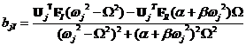

## 周波数応答解析

### 定式化

減衰を考慮しない場合の周波数応答解析の運動方程式は式のようになる。

  $$\mathbf{M}\ \ddot{\mathbf{U}} + \mathbf{\text{KU}} = \mathbf{0}$$   (2.6.1)
  --------------------------------------------------------------------- ---------

これを固有モードごとに展開すると、

  $$\mathbf{U} = \mathbf{U}_{j}e^{i\omega_{j}t}$$   (2.6.2)
  ------------------------------------------------- ---------

となる。これを式(2.6.1)に代入すると、

  $$\mathbf{K}\mathbf{U}_{j} = \omega_{j}^{2}\mathbf{M}\mathbf{U}_{j}$$   (2.6.3)
  ----------------------------------------------------------------------- ---------

を得る。この固有振動数が実数になることを以下のように証明する。$\omega_{j}^{2} = \lambda_{j}$とおき、式(2.6.3)の複素共役をとると式(2.6.4)を得る。

  ---------------------------------------------------------------------------------------------------------------------------------------------------
  $$\mathbf{K}\ \mathbf{U}_{j} = \lambda_{j}\mathbf{M}\mathbf{U}_{j}$$                                                                      (2.6.4)

  $$\mathbf{K}\overset{\overline{}}{\mathbf{U}_{j}} = \overset{\overline{}}{\lambda_{j}}\mathbf{M}\overset{\overline{}}{\mathbf{U}_{j}}$$   
  ----------------------------------------------------------------------------------------------------------------------------------------- ---------
  ---------------------------------------------------------------------------------------------------------------------------------------------------

　これに${\overset{\overline{}}{\mathbf{U}_{j}}}^{T}$をかけると、

  ---------------------------------------------------------------------------------------------------------------------------------------------------------------------------------------
  $$\mathbf{U}_{j}^{T}\mathbf{K}\overset{\overline{}}{\mathbf{U}_{j}} = \overset{\overline{}}{\lambda_{j}}\mathbf{U}_{j}^{T}\mathbf{M}\overset{\overline{}}{\mathbf{U}_{j}}$$   (2.6.5)

  $${\overset{\overline{}}{\mathbf{U}_{j}}}^{T}\mathbf{K}\mathbf{U}_{j} = {\lambda_{j}\overset{\overline{}}{\mathbf{U}_{j}}}^{T}\mathbf{M}\mathbf{U}_{j}$$                      
  ----------------------------------------------------------------------------------------------------------------------------------------------------------------------------- ---------
  ---------------------------------------------------------------------------------------------------------------------------------------------------------------------------------------

を得る。式(2.6.5)より、

  $$0 = \left( \lambda_{j} - \overset{\overline{}}{\lambda_{j}} \right){\overset{\overline{}}{\mathbf{U}_{j}}}^{T}\mathbf{M}\mathbf{U}_{j}$$   (2.6.6)
  -------------------------------------------------------------------------------------------------------------------------------------------- ---------

となる。ここで、質量マトリクスは正定値対称なのでゼロベクトルでない固有ベクトルについて

  $$\overset{\overline{}}{\mathbf{U}_{j}}\ \mathbf{M}\mathbf{U}_{j}\  > 0$$   (2.6.7)
  --------------------------------------------------------------------------- ---------

が成り立つ。ゆえに、

  $$\lambda_{j} = \overset{\overline{}}{\lambda_{j}}$$   (2.6.8)
  ------------------------------------------------------ ---------

となり、$\omega_{j}^{2} = \lambda_{j}$は実数となる。ここで、2つの違うモードについて考える。

  -------------------------------------------------------------------------------------------
  $$\mathbf{K}\mathbf{U}_{i} = \lambda_{i}\ \mathbf{\text{M\ }}\mathbf{U}_{i}$$     (2.6.9)

  $$\mathbf{K}\mathbf{U}_{j}\  = \lambda_{j}\ \mathbf{\text{M\ }}\mathbf{U}_{j}$$   
  --------------------------------------------------------------------------------- ---------
  -------------------------------------------------------------------------------------------

これより、

  $$\left( \lambda_{i} - \lambda_{j} \right)\mathbf{U}_{j}^{T}\mathbf{M}\mathbf{U}_{i} = 0$$   (2.6.10)
  -------------------------------------------------------------------------------------------- ----------

が得られ、固有値が異なる場合には、

  $$\mathbf{U}_{j}^{T}\mathbf{\text{M\ }}\mathbf{U}_{i} = 0$$   (2.6.11)
  ------------------------------------------------------------- ----------

となる。すなわち異なる固有モードは質量マトリクスについて直交する。同じモードについては質量マトリクスについて規格化する(式(2.6.12))ことによって取り扱いが容易になる利点がある。

  $$\mathbf{U}_{i}^{T}\ \mathbf{M}\mathbf{U}_{i}\  = 1$$   (2.6.12)
  -------------------------------------------------------- ----------

次に、減衰を考慮した場合の周波数応答解析についての定式化を示す。対象とする運動方程式を式(2.6.13)に示す。

     (2.6.13)
  ------------------------- ----------

ここでの減衰項はRayleigh型を想定して(2.6.14)のようにして表せるものとする。

     (2.6.14)
  ------------------------- ----------

固有値解析で得られた固有ベクトルにより変位ベクトルは時刻*t*において式(2.6.15)のように展開できる。

     (2.6.15)
  ------------------------- ----------

このとき、外力項が調和振動子式の

     (2.6.16)
  ------------------------- ----------

場合においてを決定する。運動方程式(2.6.13)は強制振動の形になるので

     (2.6.17)
  ------------------------- ----------

が成り立つ。の展開係数の実部および虚部を求めると式(2.6.18)および式(2.6.19)の形になる。

     (2.6.18)
  ------------------------- ----------
     (2.6.19)

となる。

参考文献

・久田・野口、非線形有限要素法の基礎と応用、丸善(1995).

・O.C.Zienkiewicz, R.L.Taylor: The Finite Element Method, 6^th^ Ed.,
Vol.2: McGraw-Hill, 2005

・計算力学ハンドブック　第I巻　有限要素法（構造編）、日本機械学会(1998).

・鷲津久一郎・宮本博・山田嘉昭・山本善之・川井忠彦、有限要素法ハンドブック,（I基礎編）、培風館(1982).

・森正武・杉原正顕・室田一雄、線形計算、岩波書店(1994)．

・Lois Komzsik:The Lanczos Method Evolution and Application:Siam、2003.

・戸川隼人、有限要素法による振動解析、サイエンス社(1997)

・矢川元基・宮崎則幸、有限要素法による熱応力・クリープ。熱伝導解析、サイエンス社（1985）
